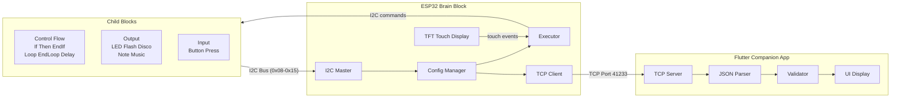
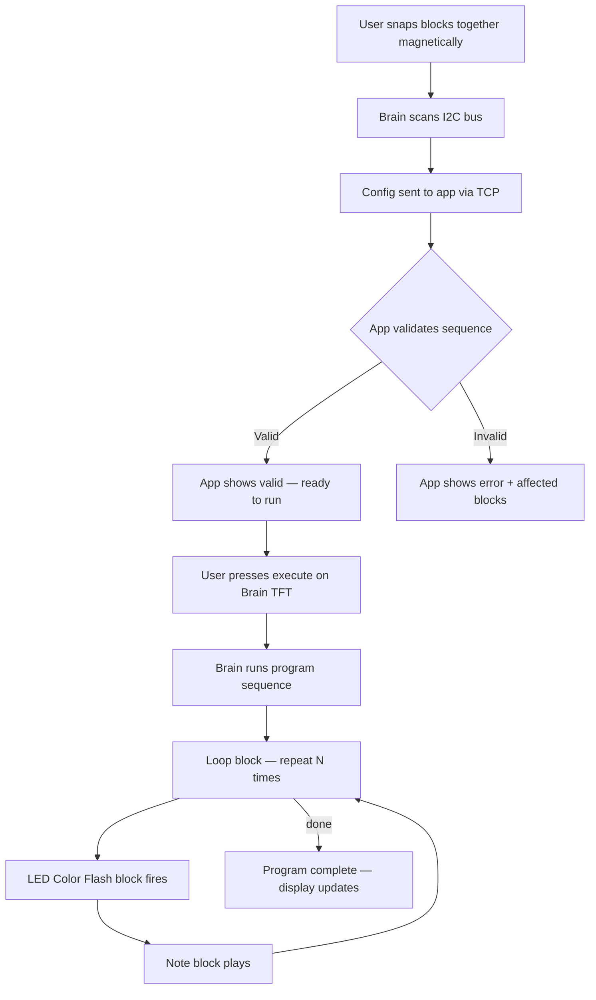

# Midterm Demo: Visuals for Video

Render Mermaid diagrams with [Mermaid Live Editor](https://mermaid.live) or the VS Code Mermaid extension, then export as PNG/SVG for slides. Fill-in tables are for use on slides or in screen recordings during Part 3.

---

## Part 1: Slides

### 1.1 Title Slide

Contents:
- Project name: **Blocks o' Code v3**
- Course name and term
- Team name
- Member names and roles (e.g. Firmware, App, Hardware)

---

### 1.2 Problem & Goal Slide

Suggested layout:
- **Problem**: Programming is abstract and inaccessible to beginners.
- **Solution**: A physical, block-based programming system where users snap together magnetic blocks to build programs.
- **Goal**: Make programming tangible, immediate, and fun — no screen required to author a program.

---

### 1.3 Requirements Slide

Suggested layout (two-column: Functional | Engineering):

| Functional Requirements | Engineering Requirements |
|-------------------------|--------------------------|
| Detect connected blocks and order | LED color preview latency ≤ 50 ms (mean) |
| Validate block sequence (config rules) | Config-change-to-app latency ≤ 6000 ms (mean) |
| Execute program on command | I2C rise time within standard-mode spec |
| Real-time feedback (display + app) | [Add any others from your SRS] |
| Support control flow, input, output blocks | |

---

### 1.4 Subsystem Diagrams

#### 1.4.1 System-Level Block Diagram



#### 1.4.2 Child Block Categories (for narration slide)

| Category | Block Types | What it does |
|----------|-------------|--------------|
| Control Flow | If, Then, End If, Loop, End Loop, Delay | Defines program structure; no physical output |
| Output | LED Color Flash, Disco Mode, Note, Music Sequence | Produces LED / audio output; previews on config |
| Input | Button Press | Waits for physical button press before continuing |

#### 1.4.3 Brain Block Subsystems (optional callout slide)

| Component | Role |
|-----------|------|
| ESP32-WROOM | MCU |
| TFT touch display | User interaction — start/stop, status |
| I2C master (GPIO 21/22, 100 kHz) | Discovers and commands child blocks |
| Config Manager | Tracks topology, detects changes, generates JSON |
| Executor | Runs the program sequence block by block |
| TCP client | Streams config + telemetry to companion app |
| Wi-Fi | Connects to app over LAN |

#### 1.4.4 Flutter App Subsystems (optional callout slide)

| Component | Role |
|-----------|------|
| TCP server (port 41233) | Receives config from Brain Block |
| JSON parser | Parses `block_config` messages |
| Validator | Checks If/Loop sequence rules; issues errors/warnings |
| UI | Shows block list, validation state, telemetry |

---

## Part 2: Functionality Demo Visuals

### 2.1 Scenario Flow — "Build a Light + Sound Program"



### 2.2 Execution Sequence Diagram

```mermaid
sequenceDiagram
  participant User
  participant Brain as Brain Block
  participant LED as LED Color Flash Block
  participant Note as Note Block
  participant App as Flutter App
  User->>Brain: Snap blocks, press Execute
  Brain->>App: TCP send block_config + validation request
  App->>Brain: config_validation: is_valid=true
  Brain->>Brain: Start executor — enter Loop
  Brain->>LED: I2C CMD flash color
  LED->>LED: Animate LEDs
  Brain->>Note: I2C CMD play note
  Note->>Note: Play audio
  Brain->>Brain: Loop again / End Loop
  Brain->>App: TCP send updated execution state
  App->>App: Update display
```

### 2.3 Invalid Sequence Demo (software only)

Use a pre-built JSON file or the app's built-in stress test to inject an invalid `block_config`. No physical rearrangement needed.

Example invalid config to demonstrate (If block with no End If):

```json
{
  "type": "block_config",
  "timestamp": 0,
  "config": {
    "total_blocks": 4,
    "blocks": [
      { "index": 0, "i2c_address": 8, "whoami": { "block_type": "brain_block", "block_id": "BLOCK_08", "firmware_version": "1.0.0", "capabilities": [] }, "connection_order": 0 },
      { "index": 1, "i2c_address": 9, "whoami": { "block_type": "if_block",    "block_id": "BLOCK_09", "firmware_version": "1.0.0", "capabilities": [] }, "connection_order": 1 },
      { "index": 2, "i2c_address": 10, "whoami": { "block_type": "button_press", "block_id": "BLOCK_0A", "firmware_version": "1.0.0", "capabilities": [] }, "connection_order": 2 },
      { "index": 3, "i2c_address": 11, "whoami": { "block_type": "led_color_flash_block", "block_id": "BLOCK_0B", "firmware_version": "1.0.0", "capabilities": [] }, "connection_order": 3 }
    ],
    "errors": []
  }
}
```

Expected app behavior: validation error — "Incomplete If sequence: missing Then and End If blocks."

**On-screen callout**: point to the red error message and the highlighted block indices.

---

## Part 3: Engineering Spec Result Tables

### 3.1 Spec 1: LED Color Flash Preview Latency (fill after 10 runs)

| Run | Latency (ms) |
|-----|--------------|
| 1   |              |
| 2   |              |
| 3   |              |
| 4   |              |
| 5   |              |
| 6   |              |
| 7   |              |
| 8   |              |
| 9   |              |
| 10  |              |
| **Mean** |     |
| **Std dev** |  |
| **Min** |      |
| **Max** |      |

**Target**: Mean ≤ 200 ms. **Met**: Yes / No

---

### 3.2 Spec 2: Config-Change-to-App Latency (fill after 10 runs)

| Run | Latency (ms) |
|-----|--------------|
| 1   |              |
| 2   |              |
| 3   |              |
| 4   |              |
| 5   |              |
| 6   |              |
| 7   |              |
| 8   |              |
| 9   |              |
| 10  |              |
| **Mean** |     |
| **Std dev** |  |
| **Min** |      |
| **Max** |      |

**Target**: Mean ≤ 6000 ms. **Met**: Yes / No

---

### 3.3 Spec 3: I2C Rise Time (fill after 10 runs)

| Run | Rise time (ns or µs) |
|-----|----------------------|
| 1   |                      |
| 2   |                      |
| 3   |                      |
| 4   |                      |
| 5   |                      |
| 6   |                      |
| 7   |                      |
| 8   |                      |
| 9   |                      |
| 10  |                      |
| **Mean** |                 |
| **Std dev** |              |
| **Min** |                  |
| **Max** |                  |

**Target**: Within I2C standard-mode requirement (≤ 1000 ns for 100 kHz) with margin. **Met**: Yes / No

---

### 3.4 Optional: Bar or Box Plot

For Spec 1 or 2, create a bar chart (x = run 1–10, y = ms) or a box plot (min, Q1, median, Q3, max) in Excel, Google Sheets, or Python (matplotlib). Add a horizontal dashed line at the target value. Export as PNG for the slide.

---

## Slide / Camera Callout Tips

| Section | What to show |
|---------|--------------|
| 1.1 Title | Static slide; speaker intro |
| 1.2 Problem | Slide with two-sentence problem + goal |
| 1.3 Requirements | Two-column table slide |
| 1.4 Subsystems | Animate through each box in the block diagram; use the category table for child blocks |
| 2.1–2.5 Live demo | Camera on hardware (magnetic connection, LED output, speaker, TFT display) + screen capture of app side-by-side |
| 2.6 Invalid sequence | Screen recording of app receiving invalid JSON and showing the error; no hardware needed |
| 3.1–3.3 Specs | Show filled results table on slide first, then camera on hardware + measurement tool for 3 live runs |
